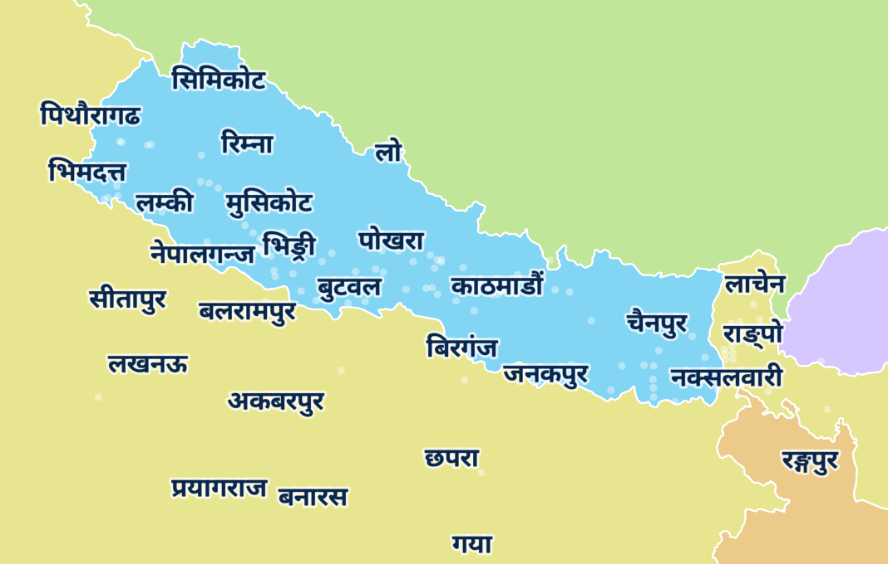

**DEPRECATED: This repo is now deprecated in favor of wipfli/pgf-encoding and wipfli/pgf-glyph-ranges. Read more here: The Protomaps Basemap can now render Devanagari labels correctly. Read more: https://oliverwipfli.ch/devanagari-in-the-protomaps-basemap-with-a-positioned-glyph-font-for-maplibre-2024-06-30/**

# nepali-map-labels
Demo of Nepali map labels with an indexed font in MapLibre GL JS

## Demo

https://wipfli.github.io/nepali-map-labels/#map=8/27/85

